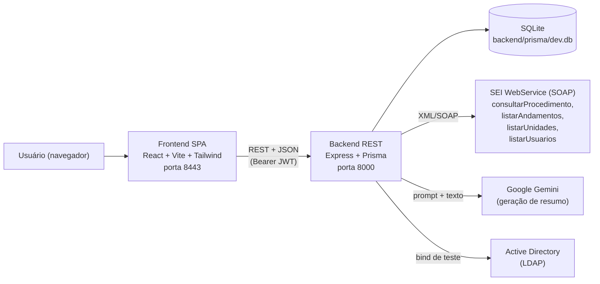
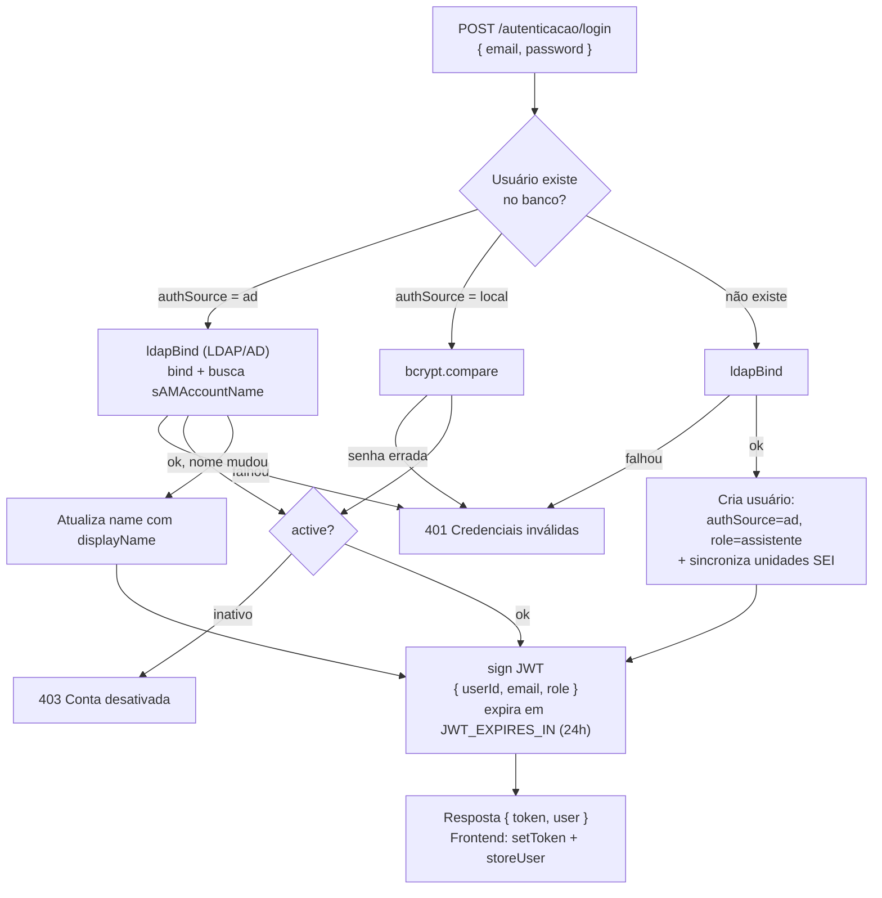
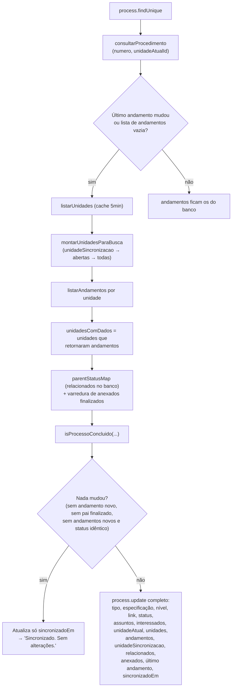
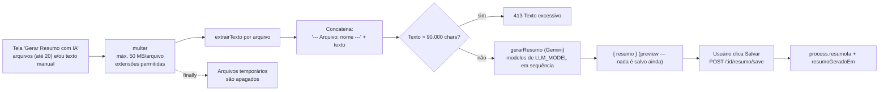

# Fluxos do Sistema CREMEPE SEI

Este documento descreve **detalhadamente todos os fluxos** do sistema em seu estado atual (conforme código-fonte). Ele substitui o antigo `fluxo-importacao-sincronizacao.md`, que cobria apenas importação e sincronização.

## Sumário

1. [Visão geral e arquitetura](#1-visão-geral-e-arquitetura)
2. [Convenções da API](#2-convenções-da-api)
3. [Autenticação e sessão](#3-autenticação-e-sessão)
4. [Permissões e controle de acesso](#4-permissões-e-controle-de-acesso)
5. [Cadastro e importação de processos](#5-cadastro-e-importação-de-processos)
6. [Sincronização com o SEI](#6-sincronização-com-o-sei)
7. [Integração SEI (SOAP)](#7-integração-sei-soap)
8. [Status, conclusão e herança](#8-status-conclusão-e-herança)
9. [Processos parados](#9-processos-parados)
10. [Resumo com IA](#10-resumo-com-ia)
11. [Anotações](#11-anotações)
12. [Tags (etiquetas)](#12-tags-etiquetas)
13. [Listagem, busca e filtros de processos](#13-listagem-busca-e-filtros-de-processos)
14. [Dashboard](#14-dashboard)
15. [Relatórios e exportações](#15-relatórios-e-exportações)
16. [Administração](#16-administração)
17. [Perfil e unidades do usuário](#17-perfil-e-unidades-do-usuário)
18. [Segurança, erros e limites](#18-segurança-erros-e-limites)
19. [Mapa de rotas do frontend](#19-mapa-de-rotas-do-frontend)
20. [Tabela completa de endpoints](#20-tabela-completa-de-endpoints)
21. [Pontos de atenção e dívidas técnicas](#21-pontos-de-atenção-e-dívidas-técnicas)

---

## 1. Visão geral e arquitetura

- **Frontend**: SPA React (`frontend/`), servida em dev pelo Vite na porta `8443`.
- **Backend**: API Express (`backend/`), porta `8000`, banco **SQLite** via Prisma.
- **Integrações externas**: SEI (SOAP), Google Gemini (resumos), Active Directory (autenticação LDAP, opcional).
- **Importante**: a API do SEI **não permite listar processos** — só consulta individual por número. Por isso todo fluxo parte de números informados pelo usuário (cadastro/importação) e é atualizado sob demanda (sincronização).

---

## 2. Convenções da API

| Item         | Convenção                                                                                                                                                                 |
| ------------ | ------------------------------------------------------------------------------------------------------------------------------------------------------------------------- |
| Base URL     | `VITE_API_URL` ou `http://127.0.0.1:8000/api` (`frontend/src/api.ts`)                                                                                                     |
| Autenticação | Header`Authorization: Bearer <JWT>` em todas as rotas (exceto `/login`)                                                                                                   |
| Erros        | JSON`{ "error": "<mensagem>" }` com status HTTP adequado (400/401/403/404/409/413/422/500)                                                                                |
| Idioma       | **Rotas de API, subrotas e parâmetros de URL da navegação em português**; _query params_ de filtro em inglês (`page`, `limit`, `search`, `status`, `unit`, `dateFrom`...) |
| Sessão       | Token + usuário no`localStorage` (`cremepe_token`, `cremepe_user`); **não há endpoint de logout** (o logout é apenas cliente)                                             |

Montagem das rotas no backend (`backend/src/index.ts`):

| Prefixo              | Router                | Assunto                                              |
| -------------------- | --------------------- | ---------------------------------------------------- |
| `/api/autenticacao`  | `routes/auth.ts`      | Login, perfil, unidades do usuário                   |
| `/api/processos`     | `routes/processes.ts` | Processos, sincronização, resumo, anotações          |
| `/api/etiquetas`     | `routes/tags.ts`      | Tags                                                 |
| `/api/administracao` | `routes/admin.ts`     | Usuários, registros e configurações (**admin only**) |
| `/api/sei`           | `routes/sei.ts`       | Unidades CREMEPE do SEI                              |
| `/api/saude`         | `index.ts`            | Health check (`{ status: "ok" }`)                    |

---

## 3. Autenticação e sessão

### 3.1 Tela de login

- `frontend/src/components/Login.tsx`: campo **Usuário** (sem `@`; o backend completa com `@cremepe.org.br`) + **Senha**; checkbox "Lembrar-me" (apenas visual — o token sempre vai para o `localStorage`).
- Texto de apoio: "Entre com sua senha do Active Directory".

### 3.2 `POST /api/autenticacao/login` — três caminhos

Detalhes:

- **LDAP opcional**: se `LDAP_URL`, `LDAP_BASE_DN` ou `LDAP_DOMAIN` não estiverem no `.env`, `ldapBind` retorna `null` e o login AD falha (só logins locais funcionam).
- **Primeiro login AD**: usuário é criado com `role: "assistente"` e, em seguida, suas unidades são buscadas no SEI (`buscarUnidadesDoUsuario`) — falha nessa etapa não impede o login (apenas aviso no log).
- **Caminho local**: `passwordHash` comparado com bcrypt (custo 12 no seed/admin).

### 3.3 Sessão no frontend (`App.tsx` + `api.ts`)

1. `login()` grava token e usuário; `App` renderiza `<Login>` enquanto `user === null`.
2. Qualquer `request()` que receba **401** dispara `clearSession()` + evento `cremepe-unauthorized` → `App` volta para o login (token expirado = saída automática).
3. Ao voltar a focar a aba (`visibilitychange`), `fetchMe()` (`GET /autenticacao/usuario-atual`) revalida e atualiza o usuário.
4. **Logout** = `clearSession()` + `setUser(null)` (sem chamada ao servidor).

### 3.4 Demais rotas de autenticação

| Rota                                      | Descrição                                                                                                               |
| ----------------------------------------- | ----------------------------------------------------------------------------------------------------------------------- |
| `GET /autenticacao/usuario-atual`         | Dados do usuário do token (usado no refresh)                                                                            |
| `GET /autenticacao/perfil`                | Perfil completo**+ unidades vinculadas** (`user_units`)                                                                 |
| `PUT /autenticacao/perfil`                | Altera`name` — **bloqueado** para usuários AD (`authSource: ad`)                                                        |
| `POST /autenticacao/sincronizar-unidades` | Refaz as unidades do usuário:**admin → todas as unidades CREMEPE**; demais → `buscarUnidadesDoUsuario(sigla do e-mail)` |
| `GET /autenticacao/sei-unidades`          | Lista unidades CREMEPE do SEI (cache)                                                                                   |

---

## 4. Permissões e controle de acesso

### 4.1 Papéis

O banco usa `role` como string. Na prática, o código só trata **três papéis**:

| Papel        | Origem                                | Comportamento                                                                                                                   |
| ------------ | ------------------------------------- | ------------------------------------------------------------------------------------------------------------------------------- |
| `admin`      | seed / criado pelo admin              | Acesso total (ver, sincronizar e excluir finalizados; administração)                                                            |
| `analista`   | seed / atribuído pelo admin           | Vê todos os processos; processos**Restritos** fora de suas unidades aparecem **mascarados** (`acessoRestrito: true`, sem dados) |
| `assistente` | criado automaticamente no 1º login AD | Vê**apenas** processos de suas unidades vinculadas                                                                              |

> O schema comenta `protocolo` e `gestor`, mas eles **não têm regras próprias** — caem no "demais papéis" e são tratados como visibilidade ampla (sem bloqueio por unidade). O rótulo no menu (`roleLabels`) só conhece admin/assistente/analista.

### 4.2 Unidades do usuário

- Tabela `user_units` (unidade SEI: `unitId`, sigla, descrição).
- Preenchida no 1º login AD, ou por `POST /autenticacao/sincronizar-unidades` (perfil), ou por `POST /administracao/usuarios/:id/sincronizar-unidades` (admin).
- Admin recebe **todas** as unidades CREMEPE; demais recebem as unidades cuja lista de usuários do SEI contém a sigla (`listarUsuariosPorUnidade`).

### 4.3 Regras por ação (funções `verificarAcessoProcesso` / `permissaoDeAcesso`)

| Ação                                              | admin | assistente                                                                                 | analista                                                               |
| ------------------------------------------------- | ----- | ------------------------------------------------------------------------------------------ | ---------------------------------------------------------------------- |
| Listar (`GET /processos`)                         | tudo  | intersecta com suas unidades (sem unidades → lista vazia)                                  | tudo, com**mascaramento** de Restritos fora das unidades               |
| Ver detalhe, anotar, resumir, editar, sincronizar | ok    | 403 se processo fora de suas unidades                                                      | Restrito fora das unidades → payload parcial`acessoRestrito` (não 403) |
| Cadastrar/importar                                | ok    | precisa que**alguma unidade aberta** do processo esteja entre as suas (403 caso contrário) | idem assistente                                                        |
| Sincronizar processo**finalizado**                | ok    | **403** ("Somente administradores...")                                                     | **403**                                                                |
| Excluir processo                                  | ok    | 403                                                                                        | 403                                                                    |
| Administração (`/api/administracao/*`)            | ok    | 403 (`adminOnly`)                                                                          | 403                                                                    |

- Siglas consideradas do processo = siglas de `unidades` + sigla de `unidadeAtual`.
- A comparação de unidade em filtros/listagens é feita por _contains_ no JSON (`"sigla":"X"`).

---

## 5. Cadastro e importação de processos

### 5.1 Fluxo da tela `/novo-processo` (frontend)

1. Usuário cola um texto livre; o frontend extrai números com regex `\d{2}\.\d{1,2}\.\d{9}-\d` (deduplicados).
2. Botão **Importar N Processo(s)** percorre os números **um a um (sequencial)** chamando `POST /api/processos` (`createProcess`).
3. Chips coloridos acompanham o progresso (azul = processando, verde = OK, amarelo = já cadastrado, vermelho = erro); painel lateral mostra resumo (Total / Importados / Já Cadastrados / Erros) e o motivo de cada falha.
4. Ao final: "Nova Importação" ou "Ver todos os processos" (`/processos`).

### 5.2 Backend `POST /api/processos` (etapas por número)

1. Valida `numeroSei`; `findUnique` → **409** "Processo já cadastrado".
2. `consultarProcedimento(numero)` no SEI (falha → **422**).
3. Extrai **unidades abertas** (`UnidadesProcedimentoAberto`); se não-admin e nenhuma unidade aberta for do usuário → **403**.
4. Busca **andamentos**: pelas unidades abertas; se o processo não tem unidades abertas (ex.: finalizado), usa a cascata completa (`montarUnidadesParaBusca(null, [], todas CREMEPE)`). Falha ao buscar andamentos **não impede** o cadastro.
5. Calcula conclusão (`isProcessoConcluido`) e **herança reversa** (se algum processo **já finalizado no banco** anexa este número → também finalizado).
6. `process.create` com todos os campos serializados em JSON (assuntos, interessados, unidades, andamentos, relacionados, anexados, último andamento) + `sincronizadoEm`.
7. Registra `SyncLog` (`tipo: "manual"`, mensagem de sucesso).
8. Responde `201` com o processo.

### 5.3 Importação em lote `POST /api/processos/importar` (backend pronto, **sem tela**)

- Recebe `{ numeros: [...] }`; valida; busca `listarUnidades` **uma única vez** (cache).
- Processa em **lotes paralelos com concorrência = 5**; por número: checa duplicado (`skipped`), consulta SEI, permissão por unidade, andamentos (cascata se preciso), conclusão + herança, `create`.
- Registra **um** `SyncLog` (`tipo: "batch"`) com contagem de sucessos/falhas.
- Responde `{ results: [...], summary: { total, successes, errors } }`.
- Hoje **nenhuma tela chama este endpoint** (`batchImport` existe no `api.ts` mas não é usado; ver [§21](#21-pontos-de-atenção-e-dívidas-técnicas)).

---

## 6. Sincronização com o SEI

### 6.1 Núcleo: `syncProcesso(id)` (`routes/processes.ts`)

- **`statusSistema` nunca volta de `finalizado` para `em_andamento`** (a não ser que já não fosse finalizado): `finalizado` se concluído ou pai finalizado; senão `em_andamento` (ou mantém `finalizado`).
- `unidadeSincronizacao` guarda as unidades que **efetivamente retornaram andamentos** — são a primeira opção da cascata na próxima sincronização.
- Função `autoImportados` é **zero**: a auto-importação de relacionados foi removida (só são exibidos).

### 6.2 `POST /api/processos/:id/sincronizar` (individual)

1. Permissão de acesso (403 se negado).
2. Se `finalizado` e usuário não é admin → **403**.
3. Executa `syncProcesso`; registra `SyncLog` (`tipo: "manual"`, sucesso/erro).
4. Erro do SEI → **422**; sucesso → devolve o processo completo (JSON parseado) + tags.

### 6.3 `POST /api/processos/sincronizar-lote` (lote)

- Recebe `{ ids: [...] }`; **concorrência = 5**.
- Por processo: não encontrado → `error`; `finalizado` e não-admin → `skipped`; sem permissão → `skipped`; senão `syncProcesso`.
- **Não grava SyncLog** por item; responde `{ results, total, autoImportados }`.

### 6.4 Tela `/sincronizacao` (SyncPage)

- Filtros: busca, status (padrão **em andamento**), unidades (multi), tipo (multi), nível de acesso, período, "sem andamentos"; contadores de em-andamento/finalizados com os mesmos filtros.
- **Sincronizar todos**: pagina `GET /processos` com `limit: 500` (demais filtros aplicados) até acabar; envia os IDs em **sub-lotes de 5** (`syncBatch`), com barra de progresso (feito/total); ao final, diálogo de resultado e recarga da lista.
- **Sincronizar** (linha): `POST /processos/:id/sincronizar` individual.
- Clique no número navega para `/processo/:id`.

### 6.5 Onde mais se sincroniza

- Botão **"Sincronizar com SEI"** na tela de detalhes (`/processo/:id`).

---

## 7. Integração SEI (SOAP)

Serviço em `backend/src/services/sei.ts` — monta envelopes XML e envia `POST` para `SEI_URL` (`fetchSoap`), interpretando _SOAP faults_ (o SEI responde HTTP 500) como erro limpo.

| Serviço SEI                     | Uso                                                                                                                                                               | Observações                                                                                                                                  |
| ------------------------------- | ----------------------------------------------------------------------------------------------------------------------------------------------------------------- | -------------------------------------------------------------------------------------------------------------------------------------------- |
| `consultarProcedimento`         | Dados do processo (tipo, especificação, autuação, nível, assuntos, interessados, unidade atual, unidades abertas, relacionados, anexados, último andamento, link) | Tenta primeiro a`unidadeAtualId` salva; depois **cada unidade CREMEPE** até encontrar; se `SEI_ID_UNIDADE` estiver definido, restringe a ela |
| `listarAndamentos`              | Histórico de movimentações por unidade                                                                                                                            | Para cada unidade, envia tarefas 1..50 (cobertura de tipos de andamento)                                                                     |
| `listarUnidades`                | Unidades acessíveis ao serviço                                                                                                                                    | **Cache em memória de 5 min**; filtra siglas que começam com `CREMEPE`                                                                       |
| `listarUsuarios`                | Usuários de uma unidade                                                                                                                                           | Usado para descobrir as unidades de um usuário AD                                                                                            |
| `consultarDocumento` / download | Metadados e arquivo do documento                                                                                                                                  | Funções prontas no serviço,**sem endpoint exposto**                                                                                          |

### Cascata de unidades (`montarUnidadesParaBusca`)

Prioridade (sem duplicatas):

1. **`unidadeSincronizacao`** — unidades que retornaram dados na última sincronização (salvas no banco).
2. **Unidades abertas** — `UnidadesProcedimentoAberto` do SEI.
3. **Todas CREMEPE** — fallback com `listarUnidades()`.

### Descoberta de unidades de um usuário (`buscarUnidadesDoUsuario`)

`listarUnidades()` → para cada unidade, `listarUsuariosPorUnidade()` → se a **sigla** (parte local do e-mail) constar, a unidade pertence ao usuário. Otimização de custo: admin pula e recebe todas.

---

## 8. Status, conclusão e herança

### 8.1 Valores de `statusSistema`

- `em_andamento` — padrão de processos ativos (**o banco também pode conter `em_analise`, legado**: o filtro `status=em_andamento` aceita os dois).
- `finalizado` — concluído (critérios abaixo) ou herdado de pai finalizado.
- O frontend normaliza `em_analise`/`em_andamento` → `em_andamento` (`mapStatus`). As opções _Pendente_ e _Sobrestado_ **não existem mais** no filtro de relatórios.

### 8.2 Critérios de conclusão (`isProcessoConcluido`)

Um processo é **finalizado** quando:

1. **Herança**: tem processos pai (relacionados que **não** são seus anexados) e **todos** estão `finalizado` no banco (critério usado com `parentStatusMap`); **ou**
2. Não tem unidades abertas **e** o último andamento menciona **"conclusão do processo na unidade"**.

Ou seja: apenas "não ter unidades abertas" **não basta** — precisa do indício textual de conclusão (a não ser pela herança).

### 8.3 Herança reversa (pai finalizado → filho)

Antes de gravar (cadastro e sincronização), o sistema varre processos **já finalizados no banco** e verifica se algum deles **anexa** o número atual (`procedimentosAnexados`). Se sim, o filho também nasce/vira `finalizado`.

---

## 9. Processos parados

**`GET /api/processos/parados`** — usado pelo KPI do Dashboard e pela tela `/parados`.

1. Base: apenas `statusSistema = "em_andamento"`; assistente vê só suas unidades.
2. Carrega todos os processos e monta o conjunto de **filhos** (números que constam como anexados de outros processos) — **filhos são excluídos**, pois os andamentos costumam acontecer no pai.
3. Para cada processo: pega a **data/hora mais recente** entre seus andamentos (parse aceita `DD/MM/YYYY [HH:mm:ss]` e ISO); calcula `diasParado` em dias; **sem andamentos → excluído** (`diasParado: null`).
4. Ordena do mais parado para o menos; devolve número, especificação, unidade, tags, último andamento, `diasParado` e `ultimaAtividade`.

A tela `/parados` (StalledProcesses) usa esse endpoint com filtro de unidades (multi) e navega para o detalhe do processo.

---

## 10. Resumo com IA

### 10.1 Pipeline (tela de detalhes → `POST /api/processos/:id/resumo`)

- **Extração por formato** (`services/fileExtractor.ts`):
  - `.pdf` → `pdf-parse`; `.docx` → `mammoth`; `.doc` → tenta mammoth, depois `xlsx`, senão marcador "converta para .docx";
  - `.txt`/`.csv` → texto puro; `.xls`/`.xlsx` → `xlsx` (aba a aba em CSV); `.odt` → `jszip` + `content.xml`;
  - **imagens** (jpg/png/...) → marcador `[Imagem — OCR não disponível]` (**não há OCR**);
  - falha de extração de um arquivo não derruba o processo (entra um marcador de falha).
- **Prompt** (`services/gemini.ts`): resumo executivo em **um único parágrafo corrido**, sem Markdown, sem inventar informações — voltado a processos administrativos do CREMEPE.
- **Modelos**: `LLM_MODEL` é uma **lista separada por vírgula** (ex.: `gemini-3.8-flash,gemini-3.7-flash,...`) — tenta em sequência até funcionar (fallback por cota/indisponibilidade).
- **Salvamento é separado**: `POST /:id/resumo` só retorna o preview; `POST /:id/resumo/save` grava `{ resumo }` no banco. Há também `GET /:id/resumo` (retorna `resumoIa`/`resumoGeradoEm`).
- O usuário pode **editar manualmente** o resumo antes/depóis de salvar (mesmo endpoint de save).

### 10.2 Onde o resumo aparece

- Detalhe do processo (seção **Resumo**, com data/hora de geração).
- Filtro `resumo=0|1` na listagem; rota especial `/processos/sem-resumo`.
- KPIs do Dashboard (Com/Sem Resumo) e gráficos de **Cobertura do Resumo IA** nos Relatórios.

---

## 11. Anotações

Rotas sob `/api/processos/:id/anotacoes`:

| Ação                             | Regra                                                             |
| -------------------------------- | ----------------------------------------------------------------- |
| `POST`                           | Qualquer usuário com acesso ao processo; grava`userId`/`userName` |
| `GET`                            | Lista (mais recente primeiro) — exibidas no detalhe               |
| `PUT /:id/anotacoes/:anotacaoId` | **Somente o autor** pode editar                                   |
| `DELETE`                         | Autor**ou admin**                                                 |

O detalhe do processo traz limite inicial de anotações visíveis com "Mostrar todas (N)".

---

## 12. Tags (etiquetas)

- CRUD global em `/api/etiquetas` (qualquer usuário autenticado): `GET` lista; `POST` cria (409 se nome duplicado); `PUT /:id`; `DELETE /:id` (remoção em cascata dos vínculos).
- Associação a processos é feita **pelo detalhe do processo**: `PUT /api/processos/:id` com `tagIds: [...]` — o backend **substitui** todos os vínculos (`deleteMany` + `createMany`).
- Seed cria 7 tags padrão (Urgente, Análise Jurídica, Recurso, CFM, Denúncia, Ético-Disciplinar, Registro).

---

## 13. Listagem, busca e filtros de processos

**`GET /api/processos`** (`ProcessList`, `SyncPage`, `Reports`, `Dashboard`):

| Parâmetro             | Efeito                                                                                      |
| --------------------- | ------------------------------------------------------------------------------------------- |
| `page`, `limit`       | Paginação (`limit` máx. **500**)                                                            |
| `search`              | `numeroSei`, `especificacao`, `interessados`, `assuntos`, `resumoIa` (contains)             |
| `status`              | `em_andamento` (inclui legado `em_analise`) ou `finalizado`                                 |
| `unit`                | Uma sigla ou lista`SIGLA1,SIGLA2` — casa com `unidadeAtual` **ou** `unidades`               |
| `resumo`              | `1` = com resumo, `0` = sem                                                                 |
| `andamentos=0`        | Só processos sem andamentos (`andamentos = "[]"`)                                           |
| `documentos=0`        | Só processos cujos andamentos não citam "Documento"                                         |
| `tipo`, `nivelAcesso` | Igualdade exata                                                                             |
| `dateFrom`, `dateTo`  | Filtro sobre`dataAutuacao` (formato `DD/MM/AAAA` convertido para comparar com `YYYY-MM-DD`) |
| `sort`, `dir`         | `numeroSei`, `especificacao`, `dataAutuacao`, `createdAt`                                   |

Aplicação de permissão na listagem: assistente intersecta com suas unidades (sem unidades → `"__NO_ACCESS__"`); analista recebe os restritos **mascarados** (só id/número/nível/status/unidades + `acessoRestrito: true`).

Rotas de listagem especiais no frontend:

- `/processos` — listagem completa com filtros + paginação + exclusão (admin).
- `/processos/sem-resumo` — mesma listagem com `resumo=0` pré-aplicado.

---

## 14. Dashboard

**Tela `/`** (`Dashboard.tsx`):

1. **Período**: `dateFrom` inicia em **`daysAgo(182)` (últimos 6 meses)**; presets (hoje, 30/90/365 dias, ano atual), datas manuais e **"Limpar"** (volta ao default de 6 meses). `dateTo` vazio = até hoje.
2. **Dados**: `fetchAll()` pagina `GET /processos` com `limit: 500` até o fim (respeitando o período) — KPIs e gráficos são calculados **no cliente**; recarrega ao voltar o foco da aba.
3. **KPIs** (com links): Total (`/processos`), Em Andamento, Finalizados, Com Resumo, Sem Resumo (`/processos/sem-resumo`), **Processos Parados** (`/parados`, contagem via `GET /processos/parados`; se falhar, exibe "—").
4. **Gráficos**:
   - **Evolução** (linha, `#29ABE2` Autuações por `dataAutuacao` × `#009C60` Finalizados por data do último andamento, quando `status = finalizado`); dias com **zero** nas duas séries são descartados; ticks **semanais**; formato `mai/26`, `jan/26`, `jun`, `15`...
   - **Últimos Processos** — tabela clicável (`/processo/:id`).
   - **Processos por Unidade** (em andamento; conta cada unidade do processo; top 10).
   - **Top Tipos** (barras horizontais; rótulos podem quebrar em 2 linhas).

---

## 15. Relatórios e exportações

**Tela `/relatorios`** (`Reports.tsx`): filtros em `draft` (rascunho) aplicados por **Gerar relatório** (`generate(filters)` → `applied`), com preset "ano atual"/períodos.

1. **Consulta**: `GET /processos` paginado com `limit: 500` (mesmos filtros da tela).
2. **Seções**:
   - **Distribuição por Status** (pizza + legenda) e **Processos por Unidade** (barras) — altura 420.
   - Linha de 4 colunas: **Cobertura do Resumo IA** (barras %), **Nível de Acesso** (barras %) e tabela **Resumo por Status**.
   - **Evolução de Autuações** (linha, por dia de autuação).
   - **Top Tipos de Processo** (barras horizontais, os 10 mais frequentes do recorte).
   - **Lista de processos** (tabela paginada com navegação ao detalhe).
3. **Filtros disponíveis**: busca, período, unidades (multi), tipos (multi), nível de acesso, status (Todos / Em Andamento / Finalizado), resumo (todos/com/sem).
4. **Exportações**:
   - **CSV da listagem** — separador `;`, BOM UTF-8, nome `relatorio-processos-AAAA-MM-DD.csv`;
   - **PDF da listagem** — jsPDF paisagem + `jspdf-autotable`, com cabeçalho/filtros/período;
   - **Resumo em PDF** — jsPDF retrato (seções com filtros aplicados);
   - **Resumo em XLSX** — ExcelJS (import dinâmico), planilha formatada com banner verde e seções.

---

## 16. Administração

**Tela `/administracao`** — item de menu visível **somente para `admin`**; backend reforça com `authMiddleware + adminOnly` em todo `/api/administracao/*`.

| Seção                   | Endpoints                                                                    | Ações                                                                                                                                                                                             |
| ----------------------- | ---------------------------------------------------------------------------- | ------------------------------------------------------------------------------------------------------------------------------------------------------------------------------------------------- |
| **Usuários**            | `GET/POST /administracao/usuarios`, `PUT/DELETE /administracao/usuarios/:id` | Criar (local: senha obrigatória, hash bcrypt 12; AD: sem senha), editar papel/ativo/senha, excluir (remove`user_units` em cascata). Nome/e-mail de usuários **AD são bloqueados**                 |
| Unidades de um usuário  | `POST /administracao/usuarios/:id/sincronizar-unidades`                      | Refaz as unidades (admin → todas; demais → busca por sigla no SEI)                                                                                                                                |
| **SEI (Configurações)** | `GET/PUT /administracao/configuracoes`                                       | Tabela`configurations` (chave/valor) — **atenção**: o formulário da UI hoje não chama a API e o serviço SEI lê **apenas variáveis de ambiente** ([§21](#21-pontos-de-atenção-e-dívidas-técnicas)) |
| **Registros**           | `GET /administracao/registros`                                               | 100 últimos`SyncLog` (data, tipo manual/batch/auto, status, mensagem, processo)                                                                                                                   |

---

## 17. Perfil e unidades do usuário

**Tela `/perfil`** (`Profile.tsx`):

1. `GET /autenticacao/perfil` — dados + **unidades vinculadas** (sigla/descrição).
2. Editar nome — `PUT /autenticacao/perfil` (somente usuários locais; AD retorna 403).
3. Botão **Sincronizar minhas unidades** — `POST /autenticacao/sincronizar-unidades` (admin → todas as CREMEPE; demais → busca por sigla), mostra quantas unidades foram sincronizadas.

---

## 18. Segurança, erros e limites

- **JWT** (segredo `JWT_EXPIRES_IN`, default 24h) verificado em `authMiddleware`; rotas de admin com `adminOnly` adicional.
- **Senhas**: bcrypt custo 12; usuários AD guardam `passwordHash: ""` (autenticação só no LDAP).
- **401 global**: dispara a saída automática da sessão no frontend; **403** devolve `{ error }` com a mensagem de acesso.
- **CORS**: apenas `localhost/127.0.0.1` nas portas `5173` e `8443` (com credenciais).
- **Uploads**: `multer` em `backend/uploads/`, máx. 50 MB/arquivo, 20 arquivos, lista branca de extensões; arquivos apagados após a geração (`finally`).
- **Limites de resumo**: texto agregado ≤ 90.000 caracteres (413).
- **Concorrência**: importar/sincronizar em lote = 5 simultâneos (protege o SEI e a API).
- **Caches**: unidades CREMEPE (5 min) e unidades por usuário consultadas sob demanda.

---

## 19. Mapa de rotas do frontend

Rotas do _browser_ (React Router, `App.tsx`) — todas em português; URL desconhecida redireciona para `/`:

| Rota                    | Tela                       | Menu                         |
| ----------------------- | -------------------------- | ---------------------------- |
| `/`                     | Dashboard                  | Dashboard                    |
| `/processos`            | Lista de processos         | Processos                    |
| `/processos/sem-resumo` | Lista só sem resumo        | Sem Resumo                   |
| `/processo/:id`         | Detalhes do processo       | (clicando num processo)      |
| `/novo-processo`        | Cadastrar/importar números | Cadastrar Processo           |
| `/etiquetas`            | Gerenciar tags             | Tags                         |
| `/relatorios`           | Relatórios e exports       | Relatórios                   |
| `/sincronizacao`        | Sincronização em lote      | Sincronização                |
| `/parados`              | Processos parados          | Processos Parados            |
| `/administracao`        | Administração (admin)      | Administração                |
| `/perfil`               | Meu perfil                 | clicando no usuário (rodapé) |

Validação extra: regex `/^\/processo\/[a-f0-9-]+$/` é aceita como detalhe; demais URLs caem no `*` → `/`.

---

## 20. Tabela completa de endpoints

### `/api/autenticacao`

| Método | Rota                    | Descrição                 |
| ------ | ----------------------- | ------------------------- |
| POST   | `/login`                | Login (local ou AD) → JWT |
| GET    | `/usuario-atual`        | Usuário do token          |
| GET    | `/perfil`               | Perfil + unidades         |
| PUT    | `/perfil`               | Atualiza nome (local)     |
| POST   | `/sincronizar-unidades` | Refaz minhas unidades     |
| GET    | `/sei-unidades`         | Unidades CREMEPE do SEI   |

### `/api/processos`

| Método     | Rota                         | Descrição                                                |
| ---------- | ---------------------------- | -------------------------------------------------------- |
| GET        | `/`                          | Lista paginada com filtros                               |
| GET        | `/parados`                   | Processos parados                                        |
| POST       | `/`                          | Cadastra processo (consulta SEI)                         |
| POST       | `/importar`                  | Importação em lote (conc. 5)                             |
| POST       | `/sincronizar-lote`          | Sincronização em lote (conc. 5)                          |
| GET        | `/:id`                       | Detalhes                                                 |
| PUT        | `/:id`                       | Atualiza status e/ou`tagIds`                             |
| DELETE     | `/:id`                       | Exclui (admin)                                           |
| POST       | `/:id/sincronizar`           | Sincroniza com SEI                                       |
| GET        | `/:id/andamentos`            | Andamentos**ao vivo** do SEI                             |
| GET        | `/:id/pais`                  | Processos que anexam este (busca reversa)                |
| POST       | `/:id/resumo`                | Gera resumo (multipart:`files`, `textoManual`) — preview |
| POST       | `/:id/resumo/save`           | Salva`{ resumo }`                                        |
| GET        | `/:id/resumo`                | Resumo salvo                                             |
| GET/POST   | `/:id/anotacoes`             | Lista / cria anotação                                    |
| PUT/DELETE | `/:id/anotacoes/:anotacaoId` | Editar (autor) / excluir (autor ou admin)                |

### `/api/etiquetas`

| Método     | Rota   | Descrição             |
| ---------- | ------ | --------------------- |
| GET/POST   | `/`    | Lista / cria tag      |
| PUT/DELETE | `/:id` | Atualiza / exclui tag |

### `/api/administracao` (somente admin)

| Método     | Rota                                 | Descrição                         |
| ---------- | ------------------------------------ | --------------------------------- |
| GET/POST   | `/usuarios`                          | Lista / cria usuário              |
| PUT/DELETE | `/usuarios/:id`                      | Atualiza / exclui usuário         |
| POST       | `/usuarios/:id/sincronizar-unidades` | Refaz unidades de um usuário      |
| GET        | `/registros`                         | 100 últimos logs de sincronização |
| GET/PUT    | `/configuracoes`                     | Configurações chave/valor         |

### `/api/sei` e utilitários

| Método | Rota            | Descrição                      |
| ------ | --------------- | ------------------------------ |
| GET    | `/sei/unidades` | Unidades CREMEPE (cache 5 min) |
| GET    | `/saude`        | Health check                   |

---

## 21. Pontos de atenção e dívidas técnicas

Itens conhecidos do estado atual (úteis para manutenção):

1. **`POST /processos/importar` sem interface** — o backend de importação em lote existe, mas a tela `/novo-processo` cadastra **sequencialmente** via `POST /processos` (função `batchImport` do `api.ts` não é usada).
2. **`generateSummaryFromDocs` → `/processos/:id/resumo-documentos`** — função existe no `api.ts` mas **não há rota equivalente no backend** (chamada morreria com 404; nenhum componente a usa).
3. **Configurações SEI da Administração** — `GET/PUT /administracao/configuracoes` existem, mas a UI não os chama (botão "Salvar Configurações" sem `onClick`) e **"Testar Conexão" é simulado** (sem chamada real). O serviço SEI usa **apenas** variáveis de ambiente (`SEI_URL`, `SEI_SIGLA_SISTEMA`, `SEI_IDENTIFICACAO_SERVICO`, `SEI_ID_UNIDADE`).
4. **Papéis `protocolo` e `gestor`** citados no schema não têm regras de acesso próprias.
5. **Sem sincronização automática** — não há job cron; tudo é sob demanda (página de sincronização, botões individuais).
6. **Sem OCR** — imagens entram no resumo como marcador textual.
7. **Filtro por unidade** usa _contains_ em JSON (`"sigla":"X"`), sensível a grafias exatas.
8. **Documentos do SEI** — há funções prontas (`consultarDocumento`, `obterLinkDocumento`, `extrairDocumentos`) ainda sem endpoint/uso na UI.
9. **`docs` desatualizados removidos** — o antigo `fluxo-importacao-sincronizacao.md` foi substituído por este arquivo; a especificação original (`frontend/src/imports/ESPECIFICACAO.md`) é o documento de planejamento e diverge da stack real em alguns pontos (ver nota no topo desse arquivo).

> Mantenha este documento sincronizado ao alterar rotas, permissões ou fluxos principais.
