# Fluxo de Importação e Sincronização de Processos

## Diagrama Completo

```mermaid
flowchart TD
    subgraph "ETAPA 1: IMPORTAÇÃO"
        I1["Frontend: POST /processes/import\n{ numeros: [...] }"]
        I2["Backend: valida lista"]
        I3["Prisma: findUnique\n(processo já existe?)"]
        I4{Existe?}
        I5["SOAP SEI: consultarProcedimento\nRetorna: tipo, especificação, unidade atual,\nunidades abertas, relacionados, anexados,\núltimo andamento, nível acesso, link"]
        I6["Prisma: userUnit.findMany\n(verifica permissão)"]
        I7["SOAP SEI: listarUnidades\n(cachê 5min)"]
        I8["Cascata: montarUnidadesParaBusca\n1. unidades abertas do processo\n2. todas CREMEPE"]
        I9["SOAP SEI: listarAndamentos\n(para cada unidade da cascata)"]
        I10["Registra unidadesComDados\n(quais retornaram andamentos)"]
        I11{"isProcessoConcluido?"}
        I12["Herança: algum processo pai\n(finalizado) existe no banco?"]
        I13["Prisma: findMany\n(todos processos, checa anexados)"]
        I14["Prisma: process.create\n(statusSistema = finalizado/em_andamento)"]
        I15["Prisma: syncLog.create"]
        I16["Resposta: { results, summary }"]

        I1 --> I2
        I2 --> I3
        I3 --> I4
        I4 -->|"já existe"| I16
        I4 -->|"não existe"| I5
        I5 --> I6
        I6 --> I7
        I7 --> I8
        I8 --> I9
        I9 --> I10
        I10 --> I11
        I11 -->|"não concluído"| I12
        I12 -->|"sim, pai finalizado"| I14
        I12 -->|"não"| I14
        I11 -->|"concluído"| I14
        I14 --> I15
        I15 --> I16
    end

    subgraph "ETAPA 2: SINCRONIZAÇÃO"
        S1["Frontend: POST /processes/sync-batch\n{ ids: [...] }"]
        S2["Para cada processo\n(concorrência = 5)"]
        S3["Prisma: findUnique"]
        S4{Finalizado?}
        S5["SOAP SEI: consultarProcedimento\nRetorna: dados atualizados do processo"]
        S6["Prisma: userUnit.findMany\n(cachê 5min)"]
        S7["Cascata: montarUnidadesParaBusca\n1. unidadeSincronizacao (banco)\n2. unidades abertas\n3. todas CREMEPE"]
        S8["SOAP SEI: listarAndamentos\n(para cada unidade da cascata)"]
        S9["Registra unidadesComDados"]
        S10{"isProcessoConcluido?"}
        S11["Herança: algum processo pai\n(finalizado) existe no banco?"]
        S12["Prisma: findMany\n(todos processos, checa anexados)"]
        S13["Prisma: process.update\n(atualiza todos os campos)"]
        S14["Salva unidadeSincronizacao\n(unidades que retornaram dados)"]
        S15["Resposta: { results, total }"]

        S1 --> S2
        S2 --> S3
        S3 --> S4
        S4 -->|"sim"| S15
        S4 -->|"não"| S5
        S5 --> S6
        S6 --> S7
        S7 --> S8
        S8 --> S9
        S9 --> S10
        S10 -->|"não concluído"| S11
        S11 -->|"sim, pai finalizado"| S13
        S11 -->|"não"| S13
        S10 -->|"concluído"| S13
        S13 --> S14
        S14 --> S15
    end

    subgraph "ETAPA 3: VISUALIZAÇÃO"
        V1["Frontend: GET /processes\n(paginado com filtros)"]
        V2["Frontend: GET /processes/:id"]
        V3["Frontend: GET /processes/:id/pais\n(busca processos pai)"]
        V4["Frontend: GET /dashboard\n(KPIs automáticos)"]

        V1 --> V2
        V2 --> V3
        V2 --> V4
    end

    I16 --> S1
    S15 --> V1
```

## Fluxo Detalhado por Etapa

### Etapa 1: Importação (`POST /processes/import`)

Para **cada número** (executado em paralelo, concorrência = 5):

| # | Requisição | Serviço | Dados Retornados |
|---|-----------|---------|------------------|
| 1 | `POST /processes/import` | Frontend → Backend | `{ numeros: ["26.17.000008067-4", ...] }` |
| 2 | `prisma.process.findUnique` | Backend → SQLite | Verifica se já existe |
| 3 | `consultarProcedimento(num)` | Backend → SEI SOAP | tipo, especificação, unidade atual, unidades abertas, procedimentos relacionados, procedimentos anexados, último andamento, nível acesso, link |
| 4 | `prisma.userUnit.findMany` | Backend → SQLite | Unidades vinculadas ao usuário (cachê) |
| 5 | `listarUnidades()` | Backend → SEI SOAP | Lista de todas as unidades CREMEPE (cachê 5min) |
| 6 | `montarUnidadesParaBusca()` | Backend | Monta cascata: unidades abertas → todas CREMEPE |
| 7 | `listarAndamentos(num, unidades)` | Backend → SEI SOAP | Andamentos de cada unidade |
| 8 | `isProcessoConcluido()` | Backend | Verifica se concluído (3 critérios) |
| 9 | `prisma.process.findMany` | Backend → SQLite | Herança: busca processos pai finalizados |
| 10 | `prisma.process.create` | Backend → SQLite | Salva processo com todos os dados |
| 11 | `prisma.syncLog.create` | Backend → SQLite | Registra log da importação |

### Etapa 2: Sincronização (`POST /processes/sync-batch`)

Para **cada processo** (executado em paralelo, concorrência = 5):

| # | Requisição | Serviço | Dados Retornados |
|---|-----------|---------|------------------|
| 1 | `POST /processes/sync-batch` | Frontend → Backend | `{ ids: ["...", ...] }` |
| 2 | `prisma.process.findUnique` | Backend → SQLite | Busca processo existente |
| 3 | `consultarProcedimento(num)` | Backend → SEI SOAP | Dados atualizados do processo |
| 4 | `listarUnidades()` | Backend → SEI SOAP | Lista de todas as unidades CREMEPE (cachê 5min) |
| 5 | `montarUnidadesParaBusca()` | Backend | Cascata: unidadeSincronizacao → abertas → todas |
| 6 | `listarAndamentos(num, unidades)` | Backend → SEI SOAP | Andamentos de cada unidade |
| 7 | `isProcessoConcluido()` | Backend | Verifica se concluído (3 critérios) |
| 8 | `prisma.process.findMany` | Backend → SQLite | Herança: busca processos pai finalizados |
| 9 | `prisma.process.update` | Backend → SQLite | Atualiza todos os campos |

### Etapa 3: Visualização

| # | Requisição | Serviço | Dados Retornados |
|---|-----------|---------|------------------|
| 1 | `GET /processes` | Frontend → Backend | Lista paginada com filtros |
| 2 | `GET /processes/:id` | Frontend → Backend | Detalhes do processo |
| 3 | `GET /processes/:id/pais` | Frontend → Backend | Processos pai (busca reversa) |
| 4 | `GET /dashboard` | Frontend → Backend | KPIs automáticos |

## Critérios de Conclusão (`isProcessoConcluido`)

Um processo é considerado **finalizado** quando:

1. **Sem unidades abertas** — `UnidadesProcedimentoAberto` retorna vazio
2. **Último andamento menciona conclusão** — texto contém "conclusão do processo na unidade"
3. **Todos os processos pai são finalizados** — se está anexado a processos e todos estão finalizados no banco

## Cascata de Unidades (`montarUnidadesParaBusca`)

A busca de andamentos segue esta ordem de prioridade:

1. **unidadeSincronizacao** — unidades que retornaram dados na última sincronização (salvo no banco)
2. **unidades abertas** — `UnidadesProcedimentoAberto` do SEI
3. **todas CREMEPE** — fallback: todas as unidades com sigla "CREMEPE"

## Herança de Status

Se um processo **A** anexa um processo **B**, e **A** está finalizado, então **B** também é marcado como finalizado durante:
- Importação (verifica processos já no banco)
- Sincronização (verifica processos já no banco)
